# CIDM 6330 - Assignment 1
PROJECT NAME: Construction Management System
AUTHOR: Jim Kinter
DATE: 2025-04-01
ABSTRACT: Requirements specification for a software project intended to aggregate project data from multiple indepenent systems for use in execution planning as well as reporting and dashboarding

## Introduction

## Table of contents
1 [Introduction](#introduction)
2 [Table of Contents](#table-of-contents)
3 [User Stories, Use Cases, Features, Gherkin Validation](#user-stories-use-cases-features-gherkin-validation)
    - [User Stories](#user-stories)
    - [Use Cases](#use-cases)
    - [Features](#features)
    - [Gherkin Validation](#gherkin-validation)
4 [Concept](#concept)
5 [UX Notes](#ux-notes)
6 [Interfaces (Controls)](#interfaces-controls)
7 [Behaviors](#behaviors)
    - [Feature/Package A](#featurepackage-a-appropriate-uml-diagrams)
    - [Feature/Package N](#featurepackage-n-appropriate-uml-diagrams)

## User Stories, Use Cases, Features, Gherkin Validation
### User Stories
1 As a foreman, general foreman, or superintendent I can view up to date and granular performance statistics for my crews so that I can quickly address preformance issues when a crew is functioning below plan.
2 As a workflace planner I can easily view the current planned activities and where those activities are constrained so that I can easily see where the plan needs adapted to changing conditions so that the planned progress and schedule can be maintained.
3 As a material planner I can easily see where inbound shipments are located, what materials those shipments contain, when the shipment is due to arrive at the port, when the material will clear customs, when the material will be recieved at the laydown, and when I can forecast it's availability to release to the crew for installation so that the project schedule can be maintained or adapted to execute work that will utilize materials that are on hand
4 As a Construction Manager I can see where installation project is ahead of schedule, on schedule, and behind schedule so that I can understand where I need to debottleneck the work
5 As a foreman I can easily report time, task, and actual effort for each person on my crew so that the crew can get paind and that progress and plan versus actual can be calculated
### Use Cases
#### Use Case 1:
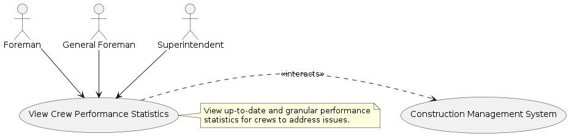
Actor: Foreman, General Foreman, Superintendent

Goal: To view up-to-date and granular performance statistics for crews to address performance issues.

Preconditions:

The actor is authenticated and authorized to access crew performance data.
Crew performance data is available in the construction management system.
Main Flow:

The actor logs into the construction management system.
The actor navigates to the crew performance dashboard.
The actor selects a specific crew or project.
The system retrieves and displays granular performance statistics (e.g., productivity metrics, task completion rates).
The actor reviews the statistics to identify performance issues.
Postconditions:

The actor has viewed the crew performance statistics and can take action to address issues.
The system remains available for further queries.
Exceptions:

If no data is available for the selected crew, the system displays a "No data available" message.
If the actor lacks authorization, the system denies access and displays an error message.

#### Use Case 2: 
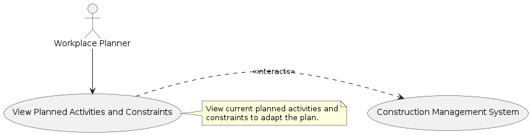
Actor: Workplace Planner

Goal: To view current planned activities and their constraints to adapt the plan to changing conditions.

Preconditions:

The actor is authenticated and authorized to access planning data.
Planned activities and constraint data are available in the construction management system.
Main Flow:

The actor logs into the construction management system.
The actor navigates to the planning overview section.
The actor selects a project or time period.
The system retrieves and displays the current planned activities and associated constraints (e.g., resource shortages, scheduling conflicts).
The actor reviews the data to identify where the plan needs adaptation.
Postconditions:

The actor has viewed the planned activities and constraints and can plan adjustments.
The system remains available for further queries.
Exceptions:

If no planned activities exist for the selected project, the system displays a "No activities found" message.
If the actor lacks authorization, the system denies access and displays an error message.

#### Use Case 3:
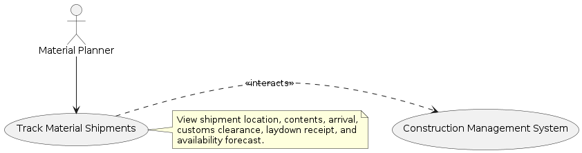
Actor: Material Planner

Goal: To track inbound shipments and forecast material availability for crew installation.

Preconditions:

The actor is authenticated and authorized to access shipment tracking data.
Shipment data (location, contents, timelines) is available in the construction management system.
Main Flow:

The actor logs into the construction management system.
The actor navigates to the material tracking section.
The actor selects a shipment or material type.
The system retrieves and displays shipment details, including:
Current location
Material contents
Port arrival date
Customs clearance date
Laydown receipt date
Forecasted availability for crew installation
The actor reviews the data to plan material release or adjust the schedule.
Postconditions:

The actor has viewed shipment tracking details and can plan material usage.
The system remains available for further queries.
Exceptions:

If no shipment data is available, the system displays a "No shipments found" message.
If the actor lacks authorization, the system denies access and displays an error message.

#### Use Case 4:
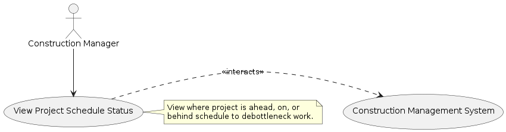
Actor: Construction Manager

Goal: To view where the installation project is ahead, on, or behind schedule to debottleneck work.

Preconditions:

The actor is authenticated and authorized to access project schedule data.
Project schedule data is available in the construction management system.
Main Flow:

The actor logs into the construction management system.
The actor navigates to the project schedule dashboard.
The actor selects a project or project phase.
The system retrieves and displays the schedule status, indicating areas that are:
Ahead of schedule
On schedule
Behind schedule
The actor reviews the status to identify areas needing debottlenecking.
Postconditions:

The actor has viewed the project schedule status and can prioritize debottlenecking efforts.
The system remains available for further queries.
Exceptions:

If no schedule data is available, the system displays a "No schedule data found" message.
If the actor lacks authorization, the system denies access and displays an error message.

#### Use Case 5:
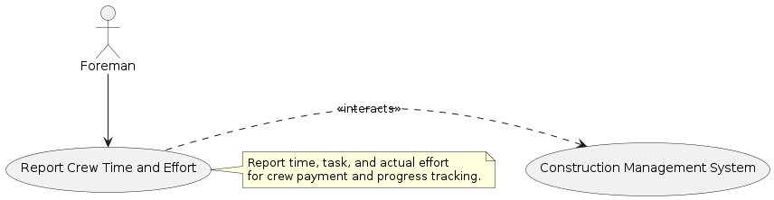
Actor: Foreman

Goal: To report time, task, and actual effort for each person on the crew for payment and progress tracking.

Preconditions:

The actor is authenticated and authorized to submit crew data.
The construction management system is available to accept time and effort reports.
Main Flow:

The actor logs into the construction management system.
The actor navigates to the time reporting section.
The actor selects a crew and date.
The actor enters time, task, and actual effort data for each crew member.
The actor submits the report.
The system validates and saves the data, confirming successful submission.
Postconditions:

The crew time and effort data is recorded for payment and progress tracking.
The actor receives confirmation of the submission.
The system remains available for further actions.
Exceptions:

If the data is incomplete or invalid, the system displays an error message and prompts the actor to correct it.
If the actor lacks authorization, the system denies access and displays an error message.

### Features
Following a gherkin Feature Statements for the application:

Feature: Crew Performance Monitoring
  In order to address performance issues quickly
  As a foreman, general foreman, or superintendent
  I want to view up-to-date and granular performance statistics for my crews

Feature: Workface Planning
  In order to adapt plans to changing conditions
  As a workplace planner
  I want to view current planned activities and their constraints

Feature: Material Shipment Tracking
  In order to maintain the project schedule
  As a material planner
  I want to track inbound shipments and forecast material availability

Feature: Project Schedule Monitoring
  In order to debottleneck project work
  As a construction manager
  I want to see where the project is ahead, on, or behind schedule

Feature: Crew Time Reporting
  In order to ensure accurate payment and progress tracking
  As a foreman
  I want to report time, task, and actual effort for my crew

### Gherkin Validation

#### Feature: Crew Performance Monitoring
  In order to address performance issues quickly
  As a foreman, general foreman, or superintendent
  I want to view up-to-date and granular performance statistics for my crews

  Scenario: Foreman views crew performance statistics
    Given the foreman is logged into the construction management system
    And crew performance data is available
    When the foreman selects a crew
    Then the system displays granular performance statistics for the crew

  Scenario: Foreman attempts to view statistics with no data available
    Given the foreman is logged into the construction management system
    And no performance data is available for the selected crew
    When the foreman selects a crew
    Then the system displays a "No data available" message

#### Feature: Workface Planning
  In order to adapt plans to changing conditions
  As a workplace planner
  I want to view current planned activities and their constraints

  Scenario: Workplace planner views planned activities and constraints
    Given the workplace planner is logged into the construction management system
    And planned activities and constraints are available
    When the workplace planner selects a project
    Then the system displays the current planned activities and their constraints

  Scenario: Workplace planner encounters no planned activities
    Given the workplace planner is logged into the construction management system
    And no planned activities exist for the selected project
    When the workplace planner selects a project
    Then the system displays a "No activities found" message

#### Feature: Material Shipment Tracking
  In order to maintain the project schedule
  As a material planner
  I want to track inbound shipments and forecast material availability

  Scenario: Material planner tracks shipment details
    Given the material planner is logged into the construction management system
    And shipment data is available
    When the material planner selects a shipment
    Then the system displays the shipment’s location, contents, arrival date, customs clearance date, laydown receipt date, and availability forecast

  Scenario: Material planner finds no shipment data
    Given the material planner is logged into the construction management system
    And no shipment data is available
    When the material planner selects a shipment
    Then the system displays a "No shipments found" message

#### Feature: Project Schedule Monitoring
  In order to debottleneck project work
  As a construction manager
  I want to see where the project is ahead, on, or behind schedule

  Scenario: Construction manager views project schedule status
    Given the construction manager is logged into the construction management system
    And project schedule data is available
    When the construction manager selects a project
    Then the system displays the project’s schedule status, indicating areas ahead, on, or behind schedule

  Scenario: Construction manager encounters no schedule data
    Given the construction manager is logged into the construction management system
    And no schedule data is available for the selected project
    When the construction manager selects a project
    Then the system displays a "No schedule data found" message

#### Feature: Crew Time Reporting
  In order to ensure accurate payment and progress tracking
  As a foreman
  I want to report time, task, and actual effort for my crew

  Scenario: Foreman reports crew time and effort
    Given the foreman is logged into the construction management system
    And the system is ready to accept time reports
    When the foreman enters time, task, and effort data for the crew
    And the foreman submits the report
    Then the system confirms successful submission

  Scenario: Foreman submits invalid time report
    Given the foreman is logged into the construction management system
    And the system is ready to accept time reports
    When the foreman enters incomplete time, task, or effort data
    And the foreman submits the report
    Then the system displays an error message prompting correction

## Concept
#### Concept: Construction Management System

##### 1. Overview
The **Construction Management System (CMS)** is a digital platform designed to streamline construction project management. It provides **real-time data** and **actionable insights** to enhance efficiency, coordination, and schedule adherence. The CMS supports key stakeholders by centralizing data on crew performance, planned activities, material logistics, project schedules, and work progress.

##### 2. Purpose
The CMS aims to:
- Enable **proactive decision-making** through real-time visibility into project metrics.
- **Reduce delays** by addressing performance issues, planning constraints, and material shortages.
- **Improve coordination** among construction teams, ensuring alignment with project goals.
- **Support accurate reporting** for payroll and progress tracking.

##### 3. Scope
The CMS delivers core functionalities to support construction project oversight:

###### Included
- **Crew Performance Monitoring**: Granular, up-to-date statistics on crew productivity and task completion.
- **Workface Planning**: Real-time tracking of planned activities and constraints for adaptive scheduling.
- **Material Shipment Tracking**: End-to-end visibility into shipment details and material availability.
- **Project Schedule Monitoring**: Status updates on project phases (ahead, on, or behind schedule).
- **Crew Time Reporting**: Submission of time, task, and effort data for crew members.

###### Excluded
- Financial management (e.g., budgeting, invoicing).
- Human resources functions (e.g., hiring, employee records).
- Detailed engineering design or CAD integration.
- Direct management of third-party logistics systems.

##### 4. Stakeholders
The CMS serves the following **primary users**:
- **Foreman**: Monitors crew performance and submits time/effort reports.
- **General Foreman & Superintendent**: Oversees multiple crews, addressing broader performance issues.
- **Workplace Planner**: Tracks activities and constraints to adapt plans.
- **Material Planner**: Manages material logistics and availability.
- **Construction Manager**: Reviews schedule status to resolve bottlenecks.

**Secondary stakeholders** include:
- **Project Owners**: Benefit from improved project outcomes.
- **IT Administrators**: Maintain system operations and security.

##### 5. Core Capabilities
The CMS provides the following features:
1. **Crew Performance Dashboard**:
   - Displays productivity metrics and task completion rates.
   - Accessible to foremen, general foremen, and superintendents.
2. **Planning Overview**:
   - Shows planned activities and constraints (e.g., resource shortages).
   - Supports workplace planners in schedule adjustments.
3. **Shipment Tracking Module**:
   - Tracks shipment location, contents, and key dates (arrival, customs, laydown, availability).
   - Enables material planners to forecast material release.
4. **Schedule Status Dashboard**:
   - Highlights project areas ahead, on, or behind schedule.
   - Assists construction managers in debottlenecking.
5. **Time Reporting Interface**:
   - Allows foremen to submit crew time, task, and effort data.
   - Supports payroll and progress tracking.

##### 6. Assumptions
The CMS operates under the following assumptions:
- **Platform**: Web-based and/or mobile application, accessible on standard devices.
- **Access**: Role-based authentication ensures users only access relevant functions.
- **Integration**: Interfaces with external systems (e.g., logistics providers) for data like shipment tracking.
- **Connectivity**: Requires a reliable network for real-time updates.
- **Security**: Complies with industry standards for data protection and privacy.

##### 7. Benefits
The CMS delivers measurable value:
- **Efficiency**: Real-time data accelerates decision-making.
- **Coordination**: Centralized platform aligns crews, planners, and managers.
- **Schedule Adherence**: Proactive monitoring minimizes delays.
- **Accuracy**: Streamlined reporting ensures reliable payroll and progress metrics.
- **Stakeholder Alignment**: User-focused design, validated through BDD (e.g., Gherkin scenarios), meets stakeholder needs.

## UX Notes
### Wireframe Diagrams for Construction Management System UI

This section presents wireframe diagrams for the **Construction Management System (CMS)** user interface, designed to support the functionalities outlined in the user stories. Each wireframe is represented using ASCII art with accompanying descriptions, focusing on key screens for the Foreman, Workplace Planner, Material Planner, and Construction Manager. The UI is intuitive, responsive, and tailored to construction professionals’ needs, emphasizing real-time data and role-based access.

#### 1. Crew Performance Dashboard (Foreman, General Foreman, Superintendent)

**Purpose**: Allows users to view granular, up-to-date crew performance statistics (e.g., productivity, task completion) to address issues.

**Wireframe**:
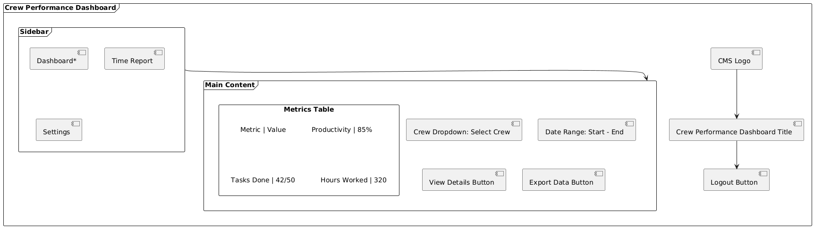

**Description**:
- **Navigation**: Top bar with CMS logo, page title, and logout button. Sidebar includes links to Dashboard (active), Time Report, and Settings.
- **Main Content**: Dropdown to select a crew, date range picker for filtering, and a table displaying key metrics (e.g., Productivity, Tasks Done). Buttons for detailed views or data export.
- **Features**: Responsive table adjusts for mobile; dropdown supports multiple crews; real-time data updates.

#### 2. Planning Overview (Workplace Planner)

**Purpose**: Displays current planned activities and constraints to support adaptive scheduling.

**Wireframe**:
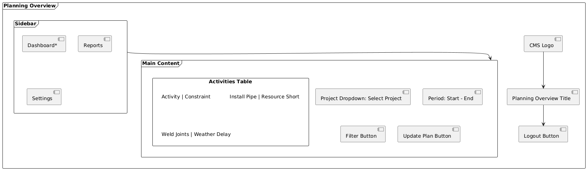

**Description**:
- **Navigation**: Top bar and sidebar similar to Crew Performance Dashboard; Dashboard link active.
- **Main Content**: Project selection dropdown, period filter, and a table listing activities and constraints (e.g., resource shortages, weather delays). Buttons to filter data or update the plan.
- **Features**: Table supports sorting by column; update button opens a modal for plan adjustments; mobile-friendly layout.

#### 3. Shipment Tracking Module (Material Planner)

**Purpose**: Tracks inbound shipments, including location, contents, and key dates, to forecast material availability.

**Wireframe**:
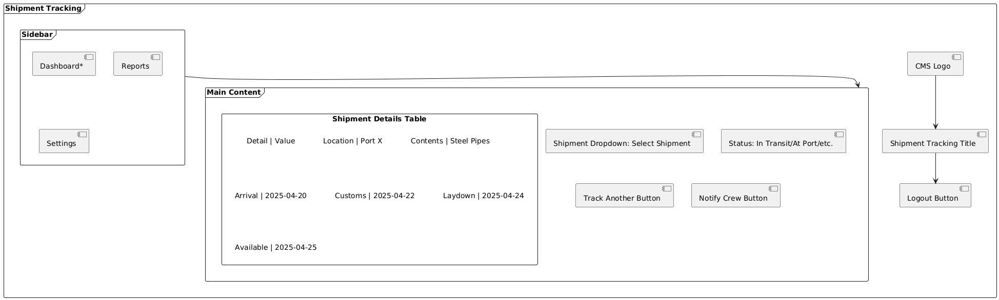

**Description**:

- **Navigation**: Consistent top bar and sidebar; Dashboard link active.
- **Main Content**: Dropdown to select a shipment, status indicator, and a table detailing location, contents, and dates (arrival, customs, laydown, availability). Buttons to track another shipment or notify crews.
- **Features**: Status indicator uses color coding (e.g., green for on-time); table is scrollable on mobile; notify button triggers alerts.

#### 4. Schedule Status Dashboard (Construction Manager)

**Purpose**: Shows project areas ahead, on, or behind schedule to identify bottlenecks.

**Wireframe**:
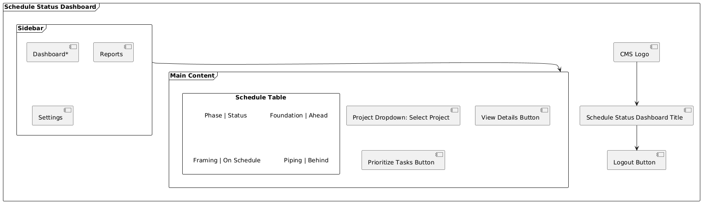

**Description**:

- **Navigation**: Standard top bar and sidebar; Dashboard link active.
- **Main Content**: Project selection dropdown and a table listing project phases with status (Ahead, On Schedule, Behind). Buttons for detailed views or task prioritization.
- **Features**: Status uses color coding (e.g., red for Behind); details button shows phase-specific data; responsive for tablet/mobile.

## 5. Time Reporting Interface (Foreman)

**Purpose**: Enables submission of crew time, task, and effort data for payroll and progress tracking.

**Wireframe**:
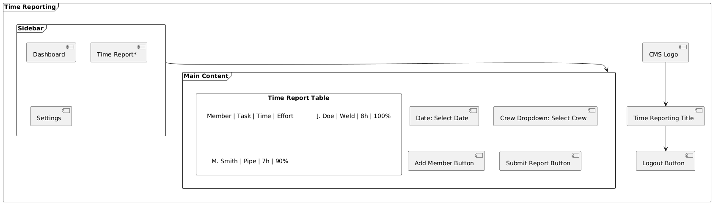

**Description**:

- **Navigation**: Top bar and sidebar; Time Report link active.
- **Main Content**: Date picker, crew dropdown, and a table for entering member names, tasks, hours, and effort percentage. Buttons to add more members or submit the report.
- **Features**: Table supports dynamic row addition; validation ensures complete data before submission; mobile layout stacks inputs vertically.

#### Notes

- **Consistency**: All screens share a common layout (top bar, sidebar, main content) for a cohesive user experience, with role-specific content.
- **Accessibility**: Large buttons and clear text support usability on mobile devices; color-coded statuses aid quick comprehension.
- **Responsiveness**: Designs are mobile-friendly, with tables scrolling or stacking as needed.
- **BDD Alignment**: UI elements align with Gherkin scenarios (e.g., selecting a crew to view statistics, submitting time reports), ensuring testability.

## Interfaces (Controls)

## Behaviors
# System Behaviors for Construction Management System

This section describes the **system behaviors** of the **Construction Management System (CMS)**, detailing how the system responds to user interactions to support construction project management. The behaviors correspond to the five user stories, covering crew performance monitoring, workface planning, material shipment tracking, project schedule monitoring, and crew time reporting. Each behavior outlines the user inputs, system processes, outputs, and exception handling, ensuring alignment with the system’s purpose of providing real-time data and actionable insights.

## 1. Crew Performance Monitoring

**Purpose**: Enables Foreman, General Foreman, or Superintendent to view up-to-date, granular crew performance statistics to address productivity issues.

**Behavior**:
- **Inputs**:
  - User logs into the CMS with valid credentials.
  - User navigates to the Crew Performance Dashboard via the sidebar.
  - User selects a crew from a dropdown menu.
  - User optionally specifies a date range using a date picker.
- **Processes**:
  - The system authenticates the user and verifies role-based access (Foreman, General Foreman, Superintendent).
  - The system retrieves performance data for the selected crew from the database, filtered by the specified date range (if provided).
  - The system formats the data into metrics (e.g., productivity percentage, tasks completed, hours worked).
- **Outputs**:
  - The system displays a table on the Crew Performance Dashboard, showing metrics like:
    - Productivity: 85%
    - Tasks Done: 42/50
    - Hours Worked: 320
  - The system provides buttons to view detailed statistics or export data as a report (e.g., CSV).
- **Exceptions**:
  - If no performance data is available for the selected crew or date range, the system displays a “No data available” message.
  - If the user lacks authorization, the system denies access and shows an “Access denied” error.
- **Wireframe Alignment**: The Crew Performance Dashboard wireframe includes a crew dropdown, date range picker, metrics table, and buttons (View Details, Export Data).
- **Gherkin Scenario Alignment**:
  - “Given the foreman is logged in and crew data is available, When the foreman selects a crew, Then the system displays granular performance statistics.”
  - “When no data is available, Then the system displays a ‘No data available’ message.”

## 2. Workface Planning

**Purpose**: Allows Workplace Planner to view current planned activities and constraints to adapt schedules.

**Behavior**:
- **Inputs**:
  - User logs into the CMS with valid credentials.
  - User navigates to the Planning Overview via the sidebar.
  - User selects a project from a dropdown menu.
  - User optionally specifies a time period using a date picker.
- **Processes**:
  - The system authenticates the user and confirms Workplace Planner role.
  - The system queries the database for planned activities and associated constraints (e.g., resource shortages, weather delays) for the selected project and period.
  - The system organizes the data into a structured format for display.
- **Outputs**:
  - The system displays a table on the Planning Overview screen, listing activities and constraints, such as:
    - Activity: Install Pipe, Constraint: Resource Shortage
    - Activity: Weld Joints, Constraint: Weather Delay
  - The system provides buttons to filter the data or update the plan (e.g., modify schedules).
- **Exceptions**:
  - If no planned activities exist for the selected project or period, the system displays a “No activities found” message.
  - If the user lacks authorization, the system denies access and shows an “Access denied” error.
- **Wireframe Alignment**: The Planning Overview wireframe includes a project dropdown, period filter, activities

### Feature: Crew Performance Monitoring

### Feature: Workface Planning
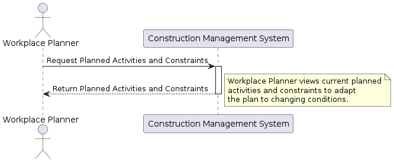

### Feature: Material Shipment Tracking
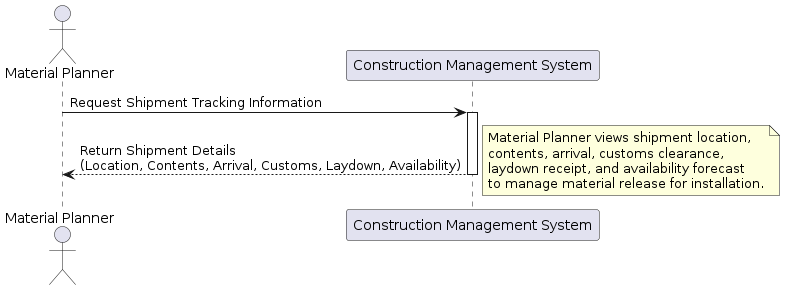

### Feature: Project Schedule Monitoring
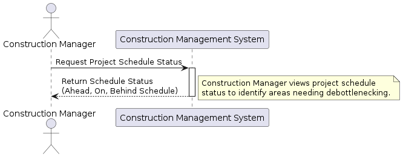

### Feature: Crew Time Reporting
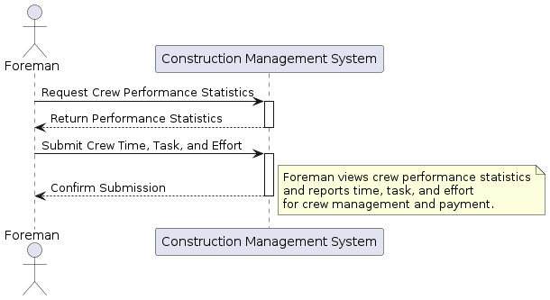